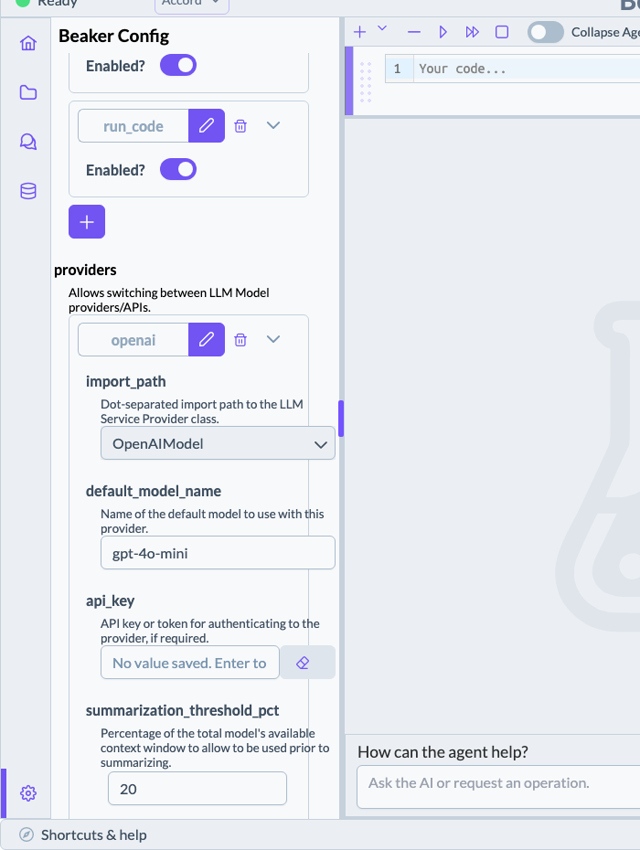

# accord-beaker

A [Beaker notebook](https://github.com/jataware/beaker-notebook) context for seasonal climate
forecasting. Install it, start Beaker, and you get a notebook whose AI agent already knows how to
drive the two ACCORD libraries — [`rosetta`](https://github.com/accord-research/rosetta) for
fetching and normalizing climate data, and
[`deepscale`](https://github.com/accord-research/deepscale) for downscaling, calibrating and
verifying forecasts.

You describe the forecast you want; it writes and runs the code.


*A full forecast end to end — CFSv2 predictor, ERA5 predictand, BCSD vs CCA under cross-validation,
tercile forecast, skill scores. 8½ minutes at 20×; [full-speed video](docs/demo.mp4).*

## Get started

```bash
git clone https://github.com/accord-research/accord-beaker.git
cd accord-beaker
uv sync
uv run beaker notebook
```

That opens `localhost:8888` on the **accord** context. Ask it something.

## You'll need an API key

Beaker drives a commercial LLM. Any of these work:

| Provider | Notes |
|---|---|
| **[OpenRouter](https://openrouter.ai/)** | **Recommended** — one key, most models, easy to switch |
| [Anthropic](https://console.anthropic.com/) | |
| [OpenAI](https://platform.openai.com/) | |
| [Gemini](https://aistudio.google.com/) | |

**Use a large, high-quality model.** We've tested across a range, and this context asks a lot of
the agent — multi-step data workflows, xarray shape juggling, reading reference docs mid-task.
Small or heavily quantized models struggle.

You don't need to configure anything up front. The first time the agent tries to reach the model
without a key, Beaker pops up a **Model Provider Configuration** dialog — pick your provider, paste
the key, and carry on.

You can also set it any time from the **gear icon** at the bottom-left, under `providers`. Pick the
provider you're using, drop your key into `api_key`, and set `default_model_name` to the model you
want:



Then set the top-level `provider` field to match. Nothing needs restarting.

## Try it

```
What seasonal forecast products can I fetch, and which need credentials I don't have?

Fetch CFSv2 precipitation hindcasts for MAM over the Horn of Africa, 1993 to 2016,
shaped for downscaling.

Downscale it against ERA5 with BCSD and CCA, and tell me which verifies better
under leave-one-year-out CV.

Produce the tercile probability forecast and score it with cross-validated RPSS.
```

Some products need credentials from the data providers themselves — `~/.cdsapirc` for
Copernicus/ERA5, and a couple of others for ECMWF and IRI. NMME needs none, so you can get a real
forecast running without any. Ask the agent which ones you're missing; it checks and tells you.

## What's inside

The agent gets the [Agent Skills](https://agentskills.io/) published alongside each library, fetched
from their repositories at session start — so a skill improved upstream reaches your notebook on the
next session with no upgrade here. It reads them only when a task needs them, so they cost almost
nothing otherwise.

The subkernel starts with `xarray as xr`, `numpy as np`, `rosetta` and `deepscale as ds` already
imported, and the preview panel shows which data-provider credentials you have.

More detail, and notes for anyone modifying this package, live in [AGENTS.md](AGENTS.md).

## Development

```bash
uv sync --extra dev
uv run pytest -m "not network"
```

## License

MIT
